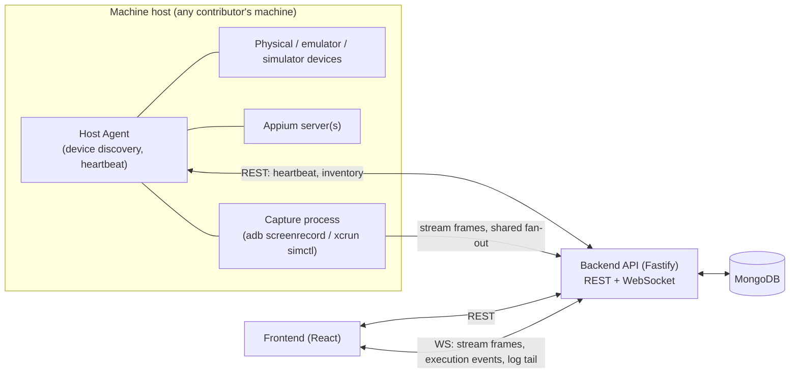
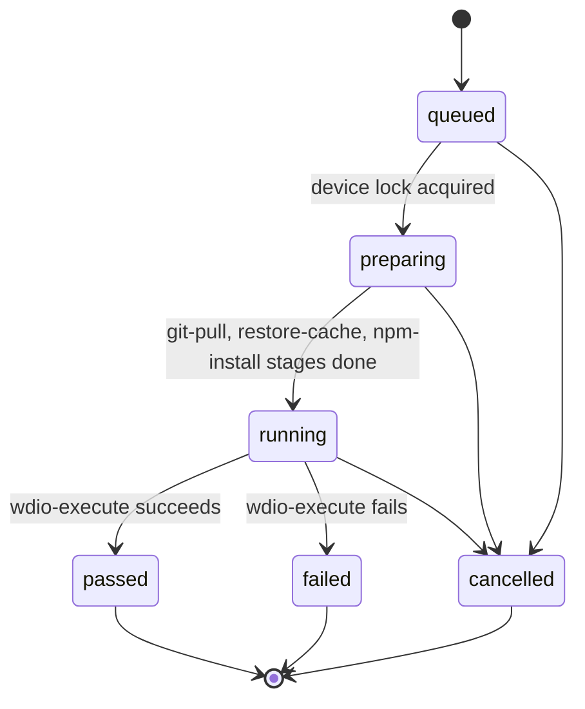

# Mobile Hub — Architecture Blueprint

Status: **planning, no code written yet**. This is the source of truth for architecture decisions — `CLAUDE.md` files point here rather than duplicating this content. Update this doc as decisions evolve; don't let it drift from what's actually built.

Reference input: a screenshot of the architecture blueprint for a proprietary tool ("Leap Mobile Inspector") in the same domain — Appium multi-server manager, device inventory, live streaming, execution pipeline, analytics dashboard. Mobile Hub reuses the shape of that architecture where it's sound, and deliberately redesigns the parts that were known late-stage pain points (see §8).

## 1. Vision & scope

An open-source shared device lab: contributors register devices (real or emulated/simulated) on their own machines, the community can see device inventory, run Appium-driven automation against them, watch a live stream of the device while a run executes, and review results/analytics afterward. Not a full CI system — it orchestrates *device execution*, not a general build server.

## 2. Locked decisions

| Decision | Choice | Why |
|---|---|---|
| Package manager | npm | Zero extra tooling knowledge required from new OSS contributors |
| Backend framework | Fastify | Lighter than NestJS, faster than Express, has the plugin ecosystem (CORS/helmet/rate-limit/JWT/swagger) we need |
| Database | MongoDB (Mongoose) | Matches reference conceptually, schema flexibility suits fast-evolving device/execution metadata, free-tier hosting (Atlas) is easy for an OSS project |
| Frontend | React 18 + Vite + TypeScript | See `frontend/CLAUDE.md` |
| License | MIT | Most permissive/common for OSS community tools |

## 3. High-level architecture



Every host machine runs a lightweight **Host Agent** (part of the backend codebase initially, not a separate package until there's a reason to split it) that owns everything local: talking to `adb`/`xcrun simctl`, spawning Appium, spawning capture processes. The central backend never assumes it's running on the same machine as a device — this is what makes multi-host isolation possible without a later migration (see §8, §5).

## 4. Data models (Mongoose)

`machineId` is a required, indexed field on every collection below that represents host-local state — this is deliberate, not an afterthought (see root `CLAUDE.md` → "Do this, not that").

### MachineHost
```ts
{
  _id, machineId: string (unique),   // stable id the host agent generates once and persists locally
  hostname, os: 'darwin' | 'linux' | 'win32',
  agentVersion, status: 'online' | 'offline' | 'degraded',
  capabilities: { maxDevices, androidSupport, iosSupport },
  lastHeartbeatAt, createdAt, updatedAt
}
```

### Device
```ts
{
  _id, udid, machineId: ref MachineHost (required, indexed),
  platform: 'android' | 'ios', name, osVersion, model,
  connectionType: 'usb' | 'network' | 'simulator' | 'emulator',
  status: 'idle' | 'in-use' | 'offline' | 'unreachable',
  lock: { heldBy: userId, sessionId, acquiredAt, reason } | null,  // explicit + queryable, never inferred from logs
  isLocallyReachable: boolean, lastSeenAt, createdAt, updatedAt
}
// unique compound index: { machineId: 1, udid: 1 }
```

### AppiumServer
```ts
{
  _id, machineId, port, pid,
  status: 'starting' | 'running' | 'stopped' | 'error',
  boundDeviceUdid?: string, startedAt, stoppedAt, logPath
}
```

### Build
```ts
{
  _id, project, platform, version,
  artifactUrl, artifactPath, sizeBytes,
  checksum, checksumAlgorithm: 'sha256',
  status: 'downloading' | 'validated' | 'corrupt' | 'ready',
  integrityValidatedAt, fetchedAt
}
```
`status` can only reach `ready` after `integrityValidatedAt` is set — this is the fix for the reference's "zip download validation missing" gap (§8).

### ExecutionRun
```ts
{
  _id, machineId, deviceUdid, buildId,
  project, branch, suite, triggeredBy: userId,
  status: 'queued' | 'preparing' | 'running' | 'passed' | 'failed' | 'cancelled',
  stages: [{ name, status: 'pending'|'running'|'done'|'error', startedAt, endedAt, error? }],
  // stages e.g.: git-pull, restore-cache, npm-install, wdio-execute — generalized from the reference's pipeline
  startedAt, endedAt, createdAt, updatedAt
}
```

### StreamSession — the multi-viewer fan-out fix
```ts
{
  _id, deviceUdid, machineId, protocol: 'mjpeg' | 'h264',
  captureStatus: 'starting' | 'active' | 'stopped', capturePid,
  viewerIds: string[], viewerCount,
  startedAt, lastViewerJoinedAt
}
// unique compound index: { machineId: 1, deviceUdid: 1, protocol: 1 }
```
Exactly **one** capture process per `(machineId, deviceUdid, protocol)`, regardless of viewer count. Viewers subscribe/unsubscribe to the existing session over WS instead of each triggering their own `adb screenrecord`/`xcrun simctl` process. This applies the pattern the reference already used for MJPEG to H264 as well, where the reference left H264 as 1:1 (see §8).

### User
```ts
{ _id, email, name, role: 'viewer' | 'operator' | 'admin', createdAt }
```
- `viewer` — read-only: device inventory, live streams, execution results, analytics.
- `operator` — viewer + trigger execution runs, acquire/release device locks.
- `admin` — operator + manage hosts, servers, users/roles.

Minimal but real from V1 — see §8 on why this isn't deferred.

### ActivityLog
```ts
{ _id, machineId, actorId, action, targetType, targetId, metadata, createdAt }
```
Append-only audit trail — who locked/unlocked a device, who triggered/cancelled a run, who registered a host.

### AnalyticsAggregate
```ts
{ _id, window: 'daily' | 'weekly', date, project, platform, totalRuns, passRate, avgDurationMs, byDevice: [{ deviceUdid, runs, passRate }] }
```
Computed by `AnalyticsService` on a schedule, read from `ExecutionRun` history. Kept as a separate service/collection from orchestration (see §5 — don't let one service own both orchestration and reporting).

## 5. Backend services

| Service | Owns | Notes |
|---|---|---|
| `MachineHostService` | host registration, heartbeat, online/offline status | marks a host offline after N missed heartbeats |
| `DeviceService` | device inventory CRUD, lock acquire/release | lock acquisition is an atomic `findOneAndUpdate`, not read-then-write |
| `AppiumServerService` | spawn/stop/health-check Appium processes per host | delegates the actual spawn to that host's agent |
| `StreamingService` | the `StreamSession` registry, viewer subscribe/unsubscribe over WS | guarantees single capture process per `(machineId, deviceUdid, protocol)` |
| `ExecutionOrchestrationService` | run queueing, the stage state machine, WS event emission | push-driven, not polled |
| `BuildsService` | fetching artifacts, checksum/size validation, serving downloads | never marks a build `ready` without a passed integrity check |
| `ActivityLogService` | append-only audit writes | write-only from other services' perspective |
| `AnalyticsService` | scheduled aggregation reads from `ExecutionRun` | intentionally separate from orchestration |
| `AuthService` | session/JWT issuance, role-check middleware | minimal in V1, structured so roles aren't a later retrofit |

All controllers stay thin (parse, validate with zod, call a service, format response) — no business logic in route handlers, per `backend/CLAUDE.md`.

## 6. Execution pipeline



Each stage transition is pushed to the frontend over WS (`/ws/execution/:runId`) along with log-tail lines — the frontend renders this as a state machine, not a poller (see `frontend/CLAUDE.md` → Architecture rules).

## 7. API surface (initial)

REST (Fastify), all under `/api`:
- `hosts` — list/register machine hosts
- `devices`, `devices/:udid/lock`, `devices/:udid/unlock`
- `servers` — Appium server list/start/stop
- `builds` — list, trigger fetch, download
- `execution/runs` — create, list, get, cancel
- `analytics` — aggregate reads

WebSocket:
- `/ws/stream/:deviceUdid?protocol=mjpeg|h264` — join/leave a `StreamSession`
- `/ws/execution/:runId` — stage transitions + log tail

## 8. Known shortcomings in the reference, and how Mobile Hub addresses them

| Reference gap | Mobile Hub fix |
|---|---|
| H264 stream not shared — N viewers spawned N `adb screenrecord` processes; MJPEG was shared but H264 wasn't | `StreamSession` model (§4) generalizes the shared-capture pattern to **both** protocols from V1 |
| Auth/RBAC not designed in until V3, retrofitted across every controller | `User.role` + middleware scoped from the first schema (§4, §5), even though the UI may only gate a subset of actions in V1 |
| Zip/build artifact download validated post-hoc, after failures surfaced as support tickets | `Build.status` can only become `ready` after a passed checksum/size check (§4) |
| Multi-host isolation added as a migration after the fact | `machineId` required + indexed on every host-local collection from the first schema (§4) |
| npm/build cache key collisions from incomplete invalidation inputs | cache key must include `package.json` hash explicitly — documented as a rule in `backend/CLAUDE.md` |
| Execution presets flagged in config but not exposed in the UI | explicitly deferred to the V2 roadmap item below, not silently dropped |

## 9. Roadmap

**V1 (MVP)**
- Host agent: device discovery + heartbeat, single Appium server per host
- Device inventory + explicit lock/unlock
- MJPEG streaming via shared `StreamSession`
- Execution run trigger, WS-pushed stage events + log tail
- Build fetch + integrity validation
- Minimal RBAC: viewer / operator
- Activity log

**V2**
- H264 streaming (shared fan-out, same `StreamSession` model as MJPEG)
- Multi-device grid view
- Analytics dashboard (`AnalyticsService` aggregates)
- Admin role: host/server management UI
- Run cancellation
- Execution presets exposed in UI

**V3**
- iOS physical device parity (currently simulator-only in scope)
- Standalone WDA lifecycle management
- Multi-viewer collaboration affordances (cursors/annotations) if there's real demand

## 11. Org & project configuration

Different organisations structure their builds, automation repos, and test frameworks completely differently. Mobile Hub adapts to them — it doesn't force a single convention.

### Config hierarchy

Two YAML files, resolved at runtime with project values overriding org defaults:

```
mobilehub.org.yaml      # org-wide defaults (committed to org's config repo)
mobilehub.project.yaml  # per-project overrides (lives alongside the project)
```

The platform merges them at execution time — project wins over org, org wins over built-in defaults. Both files are optional; a project with neither gets sensible defaults.

### Feature flags

Each major module can be toggled per org — some organisations bring their own build pipeline and don't need Mobile Hub's build fetching at all:

```yaml
# mobilehub.org.yaml
features:
  builds: true       # disable if org manages builds outside Mobile Hub
  analytics: true
  execution: true
  streaming: true
```

### Build provider

Different orgs store builds differently. A `provider` key selects an adapter; the rest of the block is provider-specific config:

```yaml
builds:
  provider: nexus        # nexus | s3 | direct-url | custom
  nexus:
    baseUrl: https://nexus.acme.com
    repo: mobile-releases
```

A `custom` provider points to a script/webhook the platform calls — escape hatch for anything not natively supported. Project-level config can override the provider entirely for that project.

### Automation framework & repo

Different orgs use different runners, repo layouts, and env/config file conventions:

```yaml
automation:
  framework: wdio          # wdio | appium-raw | espresso | xcuitest
  repoUrl: https://github.com/acme/mobile-automation
  branch: main
  structure:
    configFile: wdio.conf.js    # path within the repo
    envFile: .env
    testDir: tests/
  env:                          # values injected at run time, stored encrypted
    - key: APP_ENV
      value: staging
```

Mobile Hub clones/pulls the repo, injects env values, and invokes the runner. The `structure` block tells it where to find the config — it doesn't assume a fixed layout.

### Data models (additions)

```ts
OrgConfig   { orgId, features, builds, automation, createdAt, updatedAt }
ProjectConfig { projectId, orgId, features?, builds?, automation?, createdAt, updatedAt }
```

`ProjectConfig` is a partial override — only the keys present override the org; absent keys fall back to `OrgConfig`. Both are stored in MongoDB and also representable as YAML files (the YAML is the human-editable form; the DB record is the resolved, validated runtime form).

### Backend additions

- `ConfigService` — loads and merges org + project config, validates against a schema (Zod), caches resolved config per project
- `BuildProviderRegistry` — maps `provider` strings to adapter classes (`NexusBuildProvider`, `S3BuildProvider`, `DirectUrlBuildProvider`, `CustomBuildProvider`)
- Each `BuildProvider` implements: `fetchBuild(project, version) → artifactPath` + `listBuilds(project) → Build[]`

We will define the exact adapter interface when we start the builds module. Keep the adapter boundary narrow and stable — the rest of the system only calls the interface, never the adapter directly.

## 10. Open questions

- Host agent packaging: bundled inside `backend/` initially, or split into its own `agent/` package once it needs to ship/update independently of the central server? Revisit once V1 is running on more than one contributor's machine.
- Hosting/deploy story for the central backend + MongoDB for the community instance (Atlas free tier vs. self-hosted) — not blocking architecture work, but needed before V1 is usable by more than one person.

---

## 12. Module reference — key decisions from real implementation

This section captures concrete decisions validated by studying the reference architecture (Leap Mobile Inspector) module by module. These are not assumptions — they reflect what was actually built, what worked, and what broke. Where the reference had a known issue, Mobile Hub's approach is called out explicitly.

---

### 12a. Live device streaming

#### Device status
Add `'smoke'` to the Device status enum. Smoke = device has been recently smoke-tested and confirmed responsive, distinct from `'idle'` (available but not recently verified). Full enum:

```ts
status: 'idle' | 'smoke' | 'in-use' | 'offline' | 'unreachable'
```

#### Streaming protocols — confirmed implementation
Both protocols confirmed from reference:

| Protocol | Capture command | Transport to browser |
|---|---|---|
| **MJPEG** | `adb exec-out screencap -p` (repeated at ~10 fps) | `multipart/x-mixed-replace` HTTP stream → `` |
| **H264** | `adb screenrecord --output-format=h264 -` (pipe to stdout) | WebSocket binary frames → browser MediaSource API (MSE) |

**Separate WebSocket port for streams.** HTTP/1.1 allows only 6 concurrent connections per origin per browser. A device-streaming WebSocket on the same port as the REST API hits this ceiling on any grid view (3+ devices). The reference used a dedicated secondary port for WebSocket streams. Mobile Hub must do the same — the streaming WS server binds on a separate port, configurable, defaulting to `API_PORT + 1`.

#### retryKey pattern
When a device stream drops and reconnects, the browser client needs to distinguish "same logical stream restarted" from "totally new stream." The reference solved this with a `retryKey` — an opaque string (UUID or timestamp hash) included in the WS handshake. The client increments/replaces the key on each reconnect; the backend uses it to correlate sessions in logs. Mobile Hub should adopt this: `StreamSession.retryKey` updated on each capture restart, sent to the viewer on join.

#### Device discovery poll intervals
- **Android**: `adb devices` polled every **10 seconds** by DeviceAgentService
- **iOS simulators**: `xcrun simctl list --json` polled every **10 seconds**
- **iOS physical** (V3): WebDriverAgent-based, not polling-based

#### iOS simulator streaming limit
The reference enforced a hard cap of **8 concurrent iOS simulator streams per Mac host**. Beyond this, xcrun simctl video capture starts dropping frames silently. Mobile Hub should enforce this in `StreamingService`: reject a new iOS stream request if `viewerCount` at the host machine already equals 8 for simulator devices. (Physical iOS and Android are not subject to this limit — it's simulator-specific.)

#### Known issues fixed in Mobile Hub
- Reference bug: no idle timeout on H264 streams → processes accumulated. Mobile Hub fix: `StreamSession` has a `lastViewerJoinedAt` field; `StreamingService` tears down any session with `viewerIds.length === 0` after a **10-minute idle timeout**.
- Reference bug: H264 stream was 1 process per viewer — fixed by `StreamSession` model (§4, §8).

---

### 12b. Builds library

#### InstallJob model
The reference tracked build downloads as a separate job entity, not just status on the Build record. Mobile Hub should do the same — the download/validate pipeline is async and long-running:

```ts
InstallJob {
  _id, buildId, project, platform, version,
  status: 'queued' | 'pending' | 'downloading' | 'validating' | 'complete' | 'error',
  progress: number,           // 0–100, updated during download
  sizeBytes, downloadedBytes,
  error?: string,
  startedAt, completedAt, createdAt
}
```

`InstallJob.progress` is pushed to the frontend over WebSocket while downloading — clients show a progress bar. The `Build` record's `status` only updates to `'ready'` after the `InstallJob` reaches `'complete'` and `integrityValidatedAt` is set.

#### Build integrity — implementation detail
The reference used Python (`python3 -c "import hashlib..."`) to compute SHA-256 post-download. Mobile Hub uses Node's built-in `crypto.createHash('sha256')` streaming pipeline during download — no subprocess, no temp-file-then-hash pattern.

#### Build provider — Nexus quirk
Reference had `rejectUnauthorized: false` hardcoded for Nexus HTTPS connections (self-signed cert on internal Nexus servers). Mobile Hub must **not** default to this. The `NexusBuildProvider` config block accepts an optional `tlsSkipVerify: boolean` (default false) — orgs with self-signed certs set it explicitly in `mobilehub.org.yaml`, making the choice visible and auditable rather than silent.

#### Entity / org slug → org config
The reference used `entity` slugs (e.g., `ENBD`, `EI`, `LIV`) embedded in build paths and Nexus repo names. Mobile Hub replaces this entirely with the `OrgConfig.orgId` + `ProjectConfig.projectId` system (§11). No hardcoded slugs.

#### Known issues fixed in Mobile Hub
- Reference bug: concurrent download race — two requests for the same build could both start a download, both write to the same artifact path, corrupt the file, then both mark it complete. Mobile Hub fix: `BuildsService.fetchBuild()` uses an atomic `findOneAndUpdate` with `status: {$in: ['ready']}` check before starting — if a download is already `'downloading'`, return the existing `InstallJob` instead of starting a second one.
- Reference bug: `rejectUnauthorized: false` hardcoded silently. Fixed by explicit `tlsSkipVerify` config key.

---

### 12c. Automation execution

#### Execution stage names — confirmed
The four concrete pipeline stages from the reference (in order):

```
pulling          → git clone / git pull the automation repo
restoring_cache  → restore node_modules from cache dir if cache key matches
installing       → npm install (only if cache miss or package.json changed)
execute          → invoke the test runner (wdio, appium, espresso, etc.)
```

These map directly to the `stages` array on `ExecutionRun` (§4). The `restoring_cache` stage is where the cache key validation happens — a cache miss skips straight to `installing`.

#### Workspace and cache directory layout

```
~/mobile-hub-executions/
  workspace/
    {runId}/              ← git clone target, unique per run, deleted after run
  cache/
    {cacheKey}/           ← node_modules cache, persisted across runs
      node_modules/       ← actual cached modules
```

Cache key: `sha256(package.json contents + lockfile contents + platform + nodeVersion)`. When a run's cache key matches an existing cache dir, `node_modules` is symlinked from the cache dir into the workspace rather than copied (saves disk I/O). The symlink is the only thing in the workspace `node_modules` path.

**Important**: the cache key must include the `package.json` hash explicitly — using only the lockfile misses cases where the lockfile isn't committed or is regenerated. This is a known npm cache key collision cause from the reference (§8).

#### propChain baton pattern
The execution pipeline uses a sequential "baton pass" pattern — each stage function receives the accumulated context object from the previous stage and returns an enriched version:

```ts
type ExecutionContext = {
  runId: string;
  workspacePath: string;
  cacheKey?: string;
  cachePath?: string;
  cacheHit?: boolean;
  repoPath?: string;
  appiumCapabilities?: Record<string, unknown>;
};

// Each stage: (ctx: ExecutionContext) => Promise<ExecutionContext>
// The orchestrator chains them, updating ExecutionRun.stages on each transition.
```

If any stage throws, the chain stops, the stage is marked `error`, and `ExecutionRun.status` → `'failed'`. The orchestrator emits a WS event on every stage transition — the frontend renders the stage list in real time.

#### Log streaming — SSE, not WebSocket
**Execution log tail uses Server-Sent Events (SSE), not WebSocket.** The reference used `fs.watch` on the log file written by the test runner, then streamed new lines via SSE to the frontend. This is simpler than a bidirectional WebSocket and appropriate for log streaming (server → client only, no client messages needed).

API endpoint: `GET /api/execution/runs/:runId/logs/stream` — `text/event-stream` response. Each event is a log line:
```
event: log
data: {"line": "INFO: Starting wdio...", "timestamp": "2026-08-21T10:00:00Z"}
```

The frontend SSE client closes the connection when `ExecutionRun.status` reaches a terminal state (`passed | failed | cancelled`). The existing `/ws/execution/:runId` WebSocket is for stage transitions and structured events — the SSE endpoint is specifically for raw log lines.

#### Test reports — Allure
The reference used **Allure** for HTML test reports. Mobile Hub should assume Allure as the default report format and store the generated report directory under `workspace/{runId}/allure-report/`. Report artifact serving: expose via `GET /api/execution/runs/:runId/report` which serves the static Allure HTML. Allure config lives in the automation repo — Mobile Hub does not generate it, only serves the output.

#### Known issues fixed in Mobile Hub
- Reference issue: hardcoded tap coordinates for app environment setup (a workaround for apps that show an env-selector screen). Mobile Hub's `automation.env` block in `mobilehub.project.yaml` handles env injection at the framework config level — no tap automation needed.
- Reference issue: no concurrent run limit per device — two runs could acquire the same device if the lock wasn't checked atomically. Mobile Hub fix: device lock acquisition is always an atomic `findOneAndUpdate` with `lock: null` precondition (§5, `DeviceService`).

---

### 12d. Analytics & reporting

#### Dashboard layout zones
Six layout zones confirmed from reference:

1. **Summary KPI strip** — total runs, pass rate, avg duration (current period vs. previous period delta)
2. **Pass rate trend** — line chart, daily/weekly buckets, by platform filter
3. **Run volume** — bar chart, runs per day grouped by status (passed/failed/cancelled)
4. **Flakiness table** — per-suite, sortable by flakiness score
5. **Device utilization** — per-device run count and pass rate, tabular
6. **Recent failures** — last N failed runs with direct links

#### Recharts confirmed
Use **recharts** for all analytics charts. Pass rate trend = `LineChart`, run volume = `BarChart`, device utilization = `BarChart`. Avoid pulling in a second chart library.

#### Flakiness score — formula
Flakiness = `passRateStdDev` across rolling windows. Implementation:

```ts
// For each suite, compute pass rate per day over the last 14 days.
// Flakiness score = stddev of those daily pass rates.
// High stddev = inconsistent results = flaky suite.
flakiness = Math.sqrt(
  dailyPassRates.reduce((acc, r) => acc + Math.pow(r - mean, 2), 0) / dailyPassRates.length
);
```

Suites with fewer than 3 data points in the window are excluded from the flakiness table (not enough data to be meaningful).

#### URL-synced filter pattern
Analytics filters (date range, platform, project, org) are synced to the URL query string so that dashboard states are shareable and back-button navigable.

```ts
// frontend/src/features/analytics/hooks/useAnalyticsFilters.ts
function filtersToParams(filters: AnalyticsFilters): URLSearchParams { ... }
function paramsToFilters(params: URLSearchParams): AnalyticsFilters { ... }
```

The `useAnalytics.ts` hook composes `useSearchParams` (from React Router) with `filtersToParams`/`paramsToFilters` and feeds the result into the TanStack Query key — filter changes trigger a new query without losing history.

#### MongoDB aggregation
`AnalyticsService` runs a scheduled aggregation (cron, every hour) reading from `ExecutionRun` and writing to `AnalyticsAggregate` (§4). The aggregation pipeline groups by `{project, platform, date bucket, status}`. The frontend reads pre-aggregated data — it never queries `ExecutionRun` directly.

#### Known issues fixed in Mobile Hub
- Reference issue: analytics cache had no TTL — stale aggregates were served indefinitely after data-model changes. Mobile Hub fix: `AnalyticsAggregate` documents have a `computedAt` timestamp; `AnalyticsService` invalidates and recomputes any aggregate older than 2 hours on the next scheduled run.
- Reference issue: journey report correlation used time-only matching (runs started within N minutes of each other were treated as the same journey). This caused false correlations during concurrent runs. Mobile Hub: journey/session correlation uses explicit `sessionId` tags on `ExecutionRun` — no time-proximity guessing.
