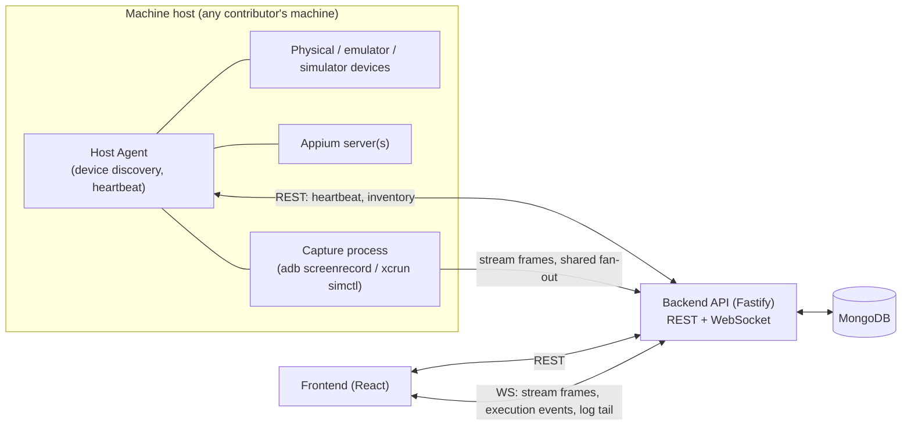
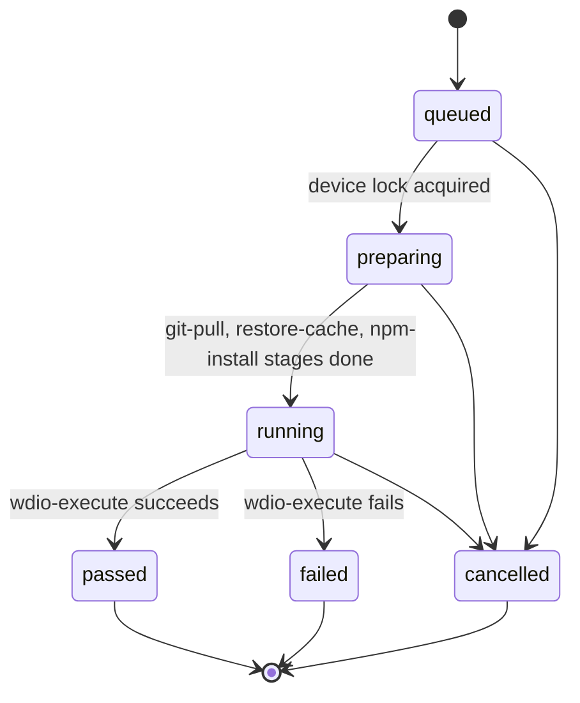

# Mobile Hub — Architecture Blueprint

Status: **planning, no code written yet**. This is the source of truth for architecture decisions — `CLAUDE.md` files point here rather than duplicating this content. Update this doc as decisions evolve; don't let it drift from what's actually built.

Reference input: a screenshot of the architecture blueprint for a proprietary tool ("Leap Mobile Inspector") in the same domain — Appium multi-server manager, device inventory, live streaming, execution pipeline, analytics dashboard. Mobile Hub reuses the shape of that architecture where it's sound, and deliberately redesigns the parts that were known late-stage pain points (see §8).

## 1. Vision & scope

An open-source shared device lab: contributors register devices (real or emulated/simulated) on their own machines, the community can see device inventory, run Appium-driven automation against them, watch a live stream of the device while a run executes, and review results/analytics afterward. Not a full CI system — it orchestrates *device execution*, not a general build server.

## 2. Locked decisions

| Decision | Choice | Why |
|---|---|---|
| Package manager | npm | Zero extra tooling knowledge required from new OSS contributors |
| Backend framework | Fastify | Lighter than NestJS, faster than Express, has the plugin ecosystem (CORS/helmet/rate-limit/JWT/swagger) we need |
| Database | MongoDB (Mongoose) | Matches reference conceptually, schema flexibility suits fast-evolving device/execution metadata, free-tier hosting (Atlas) is easy for an OSS project |
| Frontend | React 18 + Vite + TypeScript | See `frontend/CLAUDE.md` |
| License | MIT | Most permissive/common for OSS community tools |

## 3. High-level architecture



Every host machine runs a lightweight **Host Agent** (part of the backend codebase initially, not a separate package until there's a reason to split it) that owns everything local: talking to `adb`/`xcrun simctl`, spawning Appium, spawning capture processes. The central backend never assumes it's running on the same machine as a device — this is what makes multi-host isolation possible without a later migration (see §8, §5).

## 4. Data models (Mongoose)

`machineId` is a required, indexed field on every collection below that represents host-local state — this is deliberate, not an afterthought (see root `CLAUDE.md` → "Do this, not that").

### MachineHost
```ts
{
  _id, machineId: string (unique),   // stable id the host agent generates once and persists locally
  hostname, os: 'darwin' | 'linux' | 'win32',
  agentVersion, status: 'online' | 'offline' | 'degraded',
  capabilities: { maxDevices, androidSupport, iosSupport },
  lastHeartbeatAt, createdAt, updatedAt
}
```

### Device
```ts
{
  _id, udid, machineId: ref MachineHost (required, indexed),
  platform: 'android' | 'ios', name, osVersion, model,
  connectionType: 'usb' | 'network' | 'simulator' | 'emulator',
  status: 'idle' | 'in-use' | 'offline' | 'unreachable',
  lock: { heldBy: userId, sessionId, acquiredAt, reason } | null,  // explicit + queryable, never inferred from logs
  isLocallyReachable: boolean, lastSeenAt, createdAt, updatedAt
}
// unique compound index: { machineId: 1, udid: 1 }
```

### AppiumServer
```ts
{
  _id, machineId, port, pid,
  status: 'starting' | 'running' | 'stopped' | 'error',
  boundDeviceUdid?: string, startedAt, stoppedAt, logPath
}
```

### Build
```ts
{
  _id, project, platform, version,
  artifactUrl, artifactPath, sizeBytes,
  checksum, checksumAlgorithm: 'sha256',
  status: 'downloading' | 'validated' | 'corrupt' | 'ready',
  integrityValidatedAt, fetchedAt
}
```
`status` can only reach `ready` after `integrityValidatedAt` is set — this is the fix for the reference's "zip download validation missing" gap (§8).

### ExecutionRun
```ts
{
  _id, machineId, deviceUdid, buildId,
  project, branch, suite, triggeredBy: userId,
  status: 'queued' | 'preparing' | 'running' | 'passed' | 'failed' | 'cancelled',
  stages: [{ name, status: 'pending'|'running'|'done'|'error', startedAt, endedAt, error? }],
  // stages e.g.: git-pull, restore-cache, npm-install, wdio-execute — generalized from the reference's pipeline
  startedAt, endedAt, createdAt, updatedAt
}
```

### StreamSession — the multi-viewer fan-out fix
```ts
{
  _id, deviceUdid, machineId, protocol: 'mjpeg' | 'h264',
  captureStatus: 'starting' | 'active' | 'stopped', capturePid,
  viewerIds: string[], viewerCount,
  startedAt, lastViewerJoinedAt
}
// unique compound index: { machineId: 1, deviceUdid: 1, protocol: 1 }
```
Exactly **one** capture process per `(machineId, deviceUdid, protocol)`, regardless of viewer count. Viewers subscribe/unsubscribe to the existing session over WS instead of each triggering their own `adb screenrecord`/`xcrun simctl` process. This applies the pattern the reference already used for MJPEG to H264 as well, where the reference left H264 as 1:1 (see §8).

### User
```ts
{ _id, email, name, role: 'viewer' | 'operator' | 'admin', createdAt }
```
- `viewer` — read-only: device inventory, live streams, execution results, analytics.
- `operator` — viewer + trigger execution runs, acquire/release device locks.
- `admin` — operator + manage hosts, servers, users/roles.

Minimal but real from V1 — see §8 on why this isn't deferred.

### ActivityLog
```ts
{ _id, machineId, actorId, action, targetType, targetId, metadata, createdAt }
```
Append-only audit trail — who locked/unlocked a device, who triggered/cancelled a run, who registered a host.

### AnalyticsAggregate
```ts
{ _id, window: 'daily' | 'weekly', date, project, platform, totalRuns, passRate, avgDurationMs, byDevice: [{ deviceUdid, runs, passRate }] }
```
Computed by `AnalyticsService` on a schedule, read from `ExecutionRun` history. Kept as a separate service/collection from orchestration (see §5 — don't let one service own both orchestration and reporting).

## 5. Backend services

| Service | Owns | Notes |
|---|---|---|
| `MachineHostService` | host registration, heartbeat, online/offline status | marks a host offline after N missed heartbeats |
| `DeviceService` | device inventory CRUD, lock acquire/release | lock acquisition is an atomic `findOneAndUpdate`, not read-then-write |
| `AppiumServerService` | spawn/stop/health-check Appium processes per host | delegates the actual spawn to that host's agent |
| `StreamingService` | the `StreamSession` registry, viewer subscribe/unsubscribe over WS | guarantees single capture process per `(machineId, deviceUdid, protocol)` |
| `ExecutionOrchestrationService` | run queueing, the stage state machine, WS event emission | push-driven, not polled |
| `BuildsService` | fetching artifacts, checksum/size validation, serving downloads | never marks a build `ready` without a passed integrity check |
| `ActivityLogService` | append-only audit writes | write-only from other services' perspective |
| `AnalyticsService` | scheduled aggregation reads from `ExecutionRun` | intentionally separate from orchestration |
| `AuthService` | session/JWT issuance, role-check middleware | minimal in V1, structured so roles aren't a later retrofit |

All controllers stay thin (parse, validate with zod, call a service, format response) — no business logic in route handlers, per `backend/CLAUDE.md`.

## 6. Execution pipeline



Each stage transition is pushed to the frontend over WS (`/ws/execution/:runId`) along with log-tail lines — the frontend renders this as a state machine, not a poller (see `frontend/CLAUDE.md` → Architecture rules).

## 7. API surface (initial)

REST (Fastify), all under `/api`:
- `hosts` — list/register machine hosts
- `devices`, `devices/:udid/lock`, `devices/:udid/unlock`
- `servers` — Appium server list/start/stop
- `builds` — list, trigger fetch, download
- `execution/runs` — create, list, get, cancel
- `analytics` — aggregate reads

WebSocket:
- `/ws/stream/:deviceUdid?protocol=mjpeg|h264` — join/leave a `StreamSession`
- `/ws/execution/:runId` — stage transitions + log tail

## 8. Known shortcomings in the reference, and how Mobile Hub addresses them

| Reference gap | Mobile Hub fix |
|---|---|
| H264 stream not shared — N viewers spawned N `adb screenrecord` processes; MJPEG was shared but H264 wasn't | `StreamSession` model (§4) generalizes the shared-capture pattern to **both** protocols from V1 |
| Auth/RBAC not designed in until V3, retrofitted across every controller | `User.role` + middleware scoped from the first schema (§4, §5), even though the UI may only gate a subset of actions in V1 |
| Zip/build artifact download validated post-hoc, after failures surfaced as support tickets | `Build.status` can only become `ready` after a passed checksum/size check (§4) |
| Multi-host isolation added as a migration after the fact | `machineId` required + indexed on every host-local collection from the first schema (§4) |
| npm/build cache key collisions from incomplete invalidation inputs | cache key must include `package.json` hash explicitly — documented as a rule in `backend/CLAUDE.md` |
| Execution presets flagged in config but not exposed in the UI | explicitly deferred to the V2 roadmap item below, not silently dropped |

## 9. Roadmap

**V1 (MVP)**
- Host agent: device discovery + heartbeat, single Appium server per host
- Device inventory + explicit lock/unlock
- MJPEG streaming via shared `StreamSession`
- Execution run trigger, WS-pushed stage events + log tail
- Build fetch + integrity validation
- Minimal RBAC: viewer / operator
- Activity log

**V2**
- H264 streaming (shared fan-out, same `StreamSession` model as MJPEG)
- Multi-device grid view
- Analytics dashboard (`AnalyticsService` aggregates)
- Admin role: host/server management UI
- Run cancellation
- Execution presets exposed in UI

**V3**
- iOS physical device parity (currently simulator-only in scope)
- Standalone WDA lifecycle management
- Multi-viewer collaboration affordances (cursors/annotations) if there's real demand

## 11. Org & project configuration

Different organisations structure their builds, automation repos, and test frameworks completely differently. Mobile Hub adapts to them — it doesn't force a single convention.

### Config hierarchy

Two YAML files, resolved at runtime with project values overriding org defaults:

```
mobilehub.org.yaml      # org-wide defaults (committed to org's config repo)
mobilehub.project.yaml  # per-project overrides (lives alongside the project)
```

The platform merges them at execution time — project wins over org, org wins over built-in defaults. Both files are optional; a project with neither gets sensible defaults.

### Feature flags

Each major module can be toggled per org — some organisations bring their own build pipeline and don't need Mobile Hub's build fetching at all:

```yaml
# mobilehub.org.yaml
features:
  builds: true       # disable if org manages builds outside Mobile Hub
  analytics: true
  execution: true
  streaming: true
```

### Build provider

Different orgs store builds differently. A `provider` key selects an adapter; the rest of the block is provider-specific config:

```yaml
builds:
  provider: nexus        # nexus | s3 | direct-url | custom
  nexus:
    baseUrl: https://nexus.acme.com
    repo: mobile-releases
```

A `custom` provider points to a script/webhook the platform calls — escape hatch for anything not natively supported. Project-level config can override the provider entirely for that project.

### Automation framework & repo

Different orgs use different runners, repo layouts, and env/config file conventions:

```yaml
automation:
  framework: wdio          # wdio | appium-raw | espresso | xcuitest
  repoUrl: https://github.com/acme/mobile-automation
  branch: main
  structure:
    configFile: wdio.conf.js    # path within the repo
    envFile: .env
    testDir: tests/
  env:                          # values injected at run time, stored encrypted
    - key: APP_ENV
      value: staging
```

Mobile Hub clones/pulls the repo, injects env values, and invokes the runner. The `structure` block tells it where to find the config — it doesn't assume a fixed layout.

### Data models (additions)

```ts
OrgConfig   { orgId, features, builds, automation, createdAt, updatedAt }
ProjectConfig { projectId, orgId, features?, builds?, automation?, createdAt, updatedAt }
```

`ProjectConfig` is a partial override — only the keys present override the org; absent keys fall back to `OrgConfig`. Both are stored in MongoDB and also representable as YAML files (the YAML is the human-editable form; the DB record is the resolved, validated runtime form).

### Backend additions

- `ConfigService` — loads and merges org + project config, validates against a schema (Zod), caches resolved config per project
- `BuildProviderRegistry` — maps `provider` strings to adapter classes (`NexusBuildProvider`, `S3BuildProvider`, `DirectUrlBuildProvider`, `CustomBuildProvider`)
- Each `BuildProvider` implements: `fetchBuild(project, version) → artifactPath` + `listBuilds(project) → Build[]`

We will define the exact adapter interface when we start the builds module. Keep the adapter boundary narrow and stable — the rest of the system only calls the interface, never the adapter directly.

## 10. Open questions

- Host agent packaging: bundled inside `backend/` initially, or split into its own `agent/` package once it needs to ship/update independently of the central server? Revisit once V1 is running on more than one contributor's machine.
- Hosting/deploy story for the central backend + MongoDB for the community instance (Atlas free tier vs. self-hosted) — not blocking architecture work, but needed before V1 is usable by more than one person.
